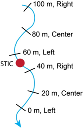

**AIMS SOP - Benthic Macroinvertebrate Field Sampling, Version 1.3**

**Daniel C. Allen [Pennsylvania State University], Michelle H. Busch [University of Kansas], Released 02/2024**

## 1.0 Abstract

The following standard operating procedure (SOP) was created for the the Aquatic Intermittency effects on Microbiomes in Streams (AIMS), an NSF EPSCoR funded project (OIA 2019603) seeking to explore the impacts of stream drying on downstream water quality across Kansas, Oklahoma, Alabama, Idaho, and Mississippi. AIMS integrates datasets on hydrology, microbiomes, macroinvertebrates, and biogeochemistry in three regions (Mountain West, Great Plains, and Southeast Forests) to test the overarching hypothesis that physical drivers (e.g., climate, hydrology) interact with biological drivers (e.g., microbes, biogeochemistry) to control water quality in intermittent streams. An overview of the AIMS project can be found here:

<iframe width="560" height="315" src="https://www.youtube.com/embed/HDKIBNEnwdM?si=dviN8DJrRRC1ke6-" title="YouTube video player" frameborder="0" allow="accelerometer; autoplay; clipboard-write; encrypted-media; gyroscope; picture-in-picture; web-share" referrerpolicy="strict-origin-when-cross-origin" allowfullscreen></iframe>

This protocol will detail the process for collecting and storing benthic macroinvertebrates collected at AIMS sites. Benthic macroinvertebrates will be collected during regular sensor maintenance (Approach 1), during seasonal synoptics (Approach 2), and during the synoptic sampling (Approach 3).

From this SOP, the following data types will be created: Macroinvertebrate DNA sequences, presence / absence data [AIMS rType: MACR]

## 2.0 Definitions and Variables

*2.1 Key Terms:*

-   Riffle: shallow part of the stream with rough/turbulent flow
-   Pool: deeper part of the stream with slow moving flow
-   Run: habitats in between riffle/pool
-   Substrate: streambed composition
-   Elutriation: the process of using moving water to suspend benthic macroinvertebrates in the water column to separate them from heavier sediment and debris

    *2.2 Primary Data* Values:

-   Benthic macroinvertebrate metabarcoding sequence data (.RAST file)

    *2.3 Supplemental Data*:

-   Associated field sheet can be found within this HydroShare resource o See also: <https://osf.io/b3wmg>
-   Substrate composition (visual estimate, % sand, silt, gravel, pebble, cobble, boulder/bedrock)
-   Algal cover (visual estimate, % filamentous and epilithon)
-   Canopy cover (% up, % down)
-   Habitat type (riffle, pool, run)
-   Flow status across reach (connected [y/n], flowing [y/n])
-   Flow status at sampling points (water status [wet/dry], isolated [y/n])
-   Wetted width (m)

## 3.0 Safety Considerations 

*3.1 Field Safety Preparation*:

-   Nothing beyond normal field safety precautions for fieldwork

*3.2 Required Safety Precautions:*

-   EtOH is flammable, use standard fire precautions around EtOH

## 4.0 Personnel and Equipment

4.1 Checklist of equipment needed:

-   100-m Fiberglass measuring tape o Forestry Suppliers, Inc.
-   1 Surber sampler, 500-micron mesh o WildCo Part \# 3-12-C50 o 500Mu Nitex Net W/Cc. (Includes Net,Frame And Cc)
-   1 D-frame net, 500-micron mesh o WildCo Part \# 3-425-D51 o D-Frame Net 500Um W/40" Hndl. Net With 40" Handle And Frame
-   3 Buckets (volume, 2 to 5 gallons is fine)
-   500 mL wide-mouth Nalgene container, bring 2 per sample you intend to collect just in case
-   95% EtOH (NOT denatured). Bring1 liter per sample you intend on collecting because particularly dense samples may need to be split into 2 500mL Nalgenes.
-   Sampling sorting tray o White 5" X 7"
-   Spherical densiometer o Convex Spherical Crown Densiometers o Forestry Suppliers Item \#: 43887
-   500-micron mesh sieve o Forestry suppliers Item \#: 53636
-   Spray bottle with a 0.5% bleach solution
-   “Rite in the rain paper” to make sample labels o riteintherain.com o Labels can be premade, or made in the field from pre-cut pieces of write-in-the-rain paper.
-   Sharpie to write on sample container

    *4.2 Estimated Time:*

-   Sampling: \~30 minutes. Sample rinsing/elutriation: \~30 minutes.

    *4.3 Allocation of effort (e.g., who does what, how many people needed to complete):*

-   At least 2 people, one in the stream doing sampling, and the other assisting. Having a third can be helpful and speed up processing.

## 5.0 Standard Operating Procedures 

*5.1 Calibration and maintenance:*

-   Not applicable

    *5.2 Preparing for Sampling:*

-   Label should contain:

    *o* Sample date (YYYYMMDD) *o* Site ID (unique DRN code, OKM01) *o* “Macros” *o* Collector name *o* Replicate number if large sample is split into multiple containers (1 of

    2, 2 of 2, etc.) o Sampling gear used (regular or mini suburbs, d-frame net)

-   **Write in pencil on a piece of “rite in the rain paper,” and place the label in the container** with the EtOH (a must), and write in sharpie on the lid (this will likely wear off, but still helpful to organize samples in the lab).

*5.3 Field Operations (step-by-step: what you do to maintain/collect samples in the field):*

1.  At each site, delineate a 100-m stream reach using a measuring tape. The midpoint of the reach (50 m) should be where the STIC sensor (during Approach 2 and 3) or the super sensor is (if sampling during sensor maintenance visits; Approach 1).
2.  Starting at the downstream end, work upstream starting at 0 m, 20 m, 40 m, 60 m, 80 m, and then 100 m. Collect a single sub-sample or “kick” at each point along the transect using the surber sampler (described below). As you work upstream, alternate collecting the sample on the left (0 and 60 m), center (40 and 80 m), and right (60 and 100 m) side of the channel; provided that the channel is wide enough. If the channel is narrow, just sample in the center. If there is no water to sample at that position, do not attempt to sample and mark it as “dry” on the data sheet.

    

3.  There are two sampling gears used for sampling macroinvertebrates: either a

    Surber sampler or a D-frame net, each suited for different flow conditions

4.  **Surber sampler**: requires current/flow. Orient the Surber with the net flowing downstream. Pick up and clean all of the rocks larger than a golf ball within the sampling frame such that all the organisms attached to them are washed downstream into the net. Set these rocks outside the sampling plot after they have been cleaned. If the substrate is consolidated, bedrock, or composed of large, heavy rocks, run your hands or feet along the substrate to displace macroinvertebrates into the net. While disturbing the plot, let the water current carry all loosened material into the net. Once the coarser substrates have been removed from the sampling plot, dig through the remaining underlying material with fingers to a depth of about 10 cm (less in sandy streams), where gravels and finer particles are often dominant. Thoroughly manipulate the substrates in the plot to encourage flow to dislodge any resistant organisms. Note: the sampler may spend as much time as necessary to inspect and clean larger substrates, but should take a standard time of 60 seconds for the digging portion of this step.
    1.  A standard-sized surber sampler (30.48 cm X 30.48 cm) with a 500 micron net should be used if the channel is large enough to accommodate it. If the channels are too narrow, then the “mini-surber” should be used (15.24 cm X 15.24 cm), and noted on the field sheet. Both surber types are available from WildCo.
5.  **D-frame net**: used in the following situations: (1) where you can’t fit the surber frame into the channel due to large rocks, but flow is still present, or (2) when there is no flow (slack water)
    1.  (1) With flow: because standard D-nets are 12 inches wide,

        imagine a 12-inch square as your sampling plot (this is the same area as the Surber 0.09 m2). Restrict sampling to within that area, sample as above with the surber method.

    2.  (2) No flow: identify 1-foot square portion of the stream bed to sample. Using the D-net, vigorously sweep the surface of the sampling area with your hands or feet while dragging the net through the disturbed area just above the bottom. Keep moving the net so that the organisms trapped in the net will not escape. Continue kicking the substrate and moving the net for 60 seconds. For vegetation-choked sampling points, sweep the net through the vegetation within a 1 ft2 (0.09 m2) plot for 60 seconds. After 60 seconds, remove the net from the water with a quick, upward motion to wash the organisms to the bottom of the net.
6.  **Habitat data***:* as you work upstream, have your sampling partner record the following ontothe data sheet.

a. At each sampling point:

*i. Wetted width:* width (m) of the stream that is covered with water *ii. Substrate composition*: estimates of substrate percentages: silt, sand, gravel, pebble, cobble, boulder, bedrock, totalling 100.

1.  *Filamentous algal and eplithon cover*: visual estimates of percent cover of filamentous algae and epilithon (biofilm). Filamentous algae types vary, but are typically greener and can form dense, hair-like mats.
    1.  *Canopy cover*: at each sampling point, take two densiometer readings (one looking upstream, one looking downstream). Please note on your data sheet if you are counting whole cells or quarter cells, and verify if the counts are open or closed canopy.
        1.  Riffle/run/pool: mark habitat type sample is collected from. vi. Wet/dry: water status at the place the sample was collected from.

            *vii.* Isolated [y/n]: is the habitat isolated or not within the sample reach.

b. Across the entire reach:

1.  Connected [y/n] : surface water connection status
    1.  Flowing [y/n]: surface flow status
2.  As you work upstream, empty the contents of the net into one of the buckets after each sample. This generates a “composite” sample. Be sure not to spill the contents!
3.  Once you have collected all the 6 samples, take the bucket sample composite to a location of the stream with a good amount of water (a pool) for serial rinsing, elutriation, and then putting the sample in the container.
    1.  *Serial Rinsing:* Using a series of three or so buckets, grab coarse organic debris, larger gravel pieces, and excess filamentous algae one handful at a time, and rinse it in subsequent buckets, with the goal of rinsing most organisms clinging to the material back into the buckets. Then place the rinsed material in a sorting tray for visual inspection and hand removal. Put any hand picked bugs into the 500mL wide-mouth Nalgene container half filled with 95% or 100% ethanol.
        1.  *Sample Elutriation:* Once all larger debris (e.g. entire leaves, conifer needles, sticks, and twigs more than 1" long) has been rinsed and inspected, elutriate the remaining material by swirling the water in the bucket so that invertebrates and fine debris are suspended, but sand and small gravel remains at the bottom of the bucket. Pour the swirling water

            and suspended material through a 500-micron mesh screen (either a steel sieve, or the Blue Ribbon Easy Catch fine-mesh aquarium net), and put the remaining sample into the 500mL wide-mouth Nalgene container half filled with 95% or 100% ethanol.

            1.  Add the sample label to the container, and screw the lid tight to ensure a good seal (date, site ID, collector, “Inverts”). Please be advised that it is very easy to cross-thread the wide-mouth Nalgenes. Using a sharpie, write the same information on the label on the lid.
            2.  If the sampled material fills more than ¾ of the sample container, split the sample among 2 500mL Nalgenes to ensure that there is adequate EtOH to preserve the sample. Record that there are 2 sample containers on the datasheet, and change interior and exterior sample labels to include “1 of 2” and “2 of 2”.

                5.4 *Quality Assurance/Quality Control (including how to handle situations when something fails QA/QC):*

            -   If the stream is dry at one of the six locations along the transect, do not try and move the sampling location; simply do not take the sample and note this on the datasheet.
            -   If the sample bucket holding the composite sample is overturned during collection, discard all sampled material downstream of sampling area and restart collections. Do not re-collect on the exact same area of streambed that you originally collected from.
            -   After sampling each site, thoroughly spray the sampling nets and sieves used with the 0.5% bleach solution to denature any DNA that might contaminate the sample collected at the next site.

                *5.5 Field or Lab datasheet/needed ancillary information:*

            -   See the Field Data sheet, “AIMS Macroinvertebrates Field Data Sheet 1.0” on Hydroshare
            -   Substrate composition (%)
            -   Algal cover (% epilithon, % filamentous algae)
            -   Wetted width (m)
            -   Canopy cover (%)
            -   Riffle/Pool/Run (at each sampling point, identify habitat type)
            -   Disconnected or Connected (over sampling reach, are wetted habitats connected or not)
            -   Flowing or non-flowing (over sampling reach, are wetted habitats flowing or non-flowing)

                *5.6 YouTube Link:*

                A YouTube video tutorial was created to describe this data collection protocol, which can be found here: <https://youtu.be/6niLLGBOoeU>

## 6.0 Sample Generated/Storage & Preservation

*6.1 Processing and Preserving Samples:*

Samples preserved in 95% EtOH in the field

6.2 *Quality Assurance/Quality Control:*

-   If any sample material is spilled or lost during EtOH refreshing, please make a note on the datasheet with an estimate of how much was spilled, and include a secondary label on write-in-the-rain paper in the sample container.

    *6.2 Sample Transport back to the lab*:

-   Within 24 hours, refresh the ethanol in the sample (empty the contents of the sample into the 500 micron sieve, put the material back into the sampling jar, and replace with new ethanol) and then freeze the sample at (-20**°**C).
-   For samples with large amounts of organic material, another EtOH refresh may be needed. If the EtOH becomes “stained” green or brown, that means that organics are leaching from algae/detritus, which can compromise the preservation. So if the EtOH is not clear, that is an indicator that another refresh of EtOH could be beneficial.

## 7.0 Sample Tracking and Destination

*7.1 Data Entry into sample Tracking System:*

-   Not applicable

    *7.2 Holding Timeline & Conditions*

-   Samples can be held indefinitely in the freezer (-20**°**C). If you don’t have access to a -20**°**C freezer, then store at -4**°**C for short periods of time before shipping (several days).

    *7.3 Processing Lab Info* (*where are they ultimately headed?):*

-   For this project, samples were processed by Jonah Ventures.

    *7.4 Sample shipping*:

-   Pour sample back through the 500 um sieve (or aquarium net) to drain the ethanol. Transfer the moist contents of the sample into a Ziploc bag, making sure to include the sample label inside the bag. Then, double bag that Ziploc bag inside a second Ziploc bag. Place each double-bagged sample inside the 500mL Nalgene sample container it came from prior to shipping. In the plastic bags, for short periods of time, the samples will remain preserved based on the residual ethanol in the organic material and bugs. Pack as much absorbent material (paper towels, newspaper) around the Nalgenes as space allows to soak up residual ethanol. All samples should be shipped on dry-ice to prevent a freeze-thaw cycle during transport.
-   Jonah Ventures requires a unique barcode from their system to be associated with individual samples. Contact Jonah Ventures to receive barcodes and match original labels with barcodes prior to shipping.
-   Make sure to arrange with someone at the receiving university prior to shipping so that they are aware a sample is coming and are prepared to receive it and immediately refill the containers with ethanol in the lab.
-   Ship samples via 2-day shipping early in the week (i.e. Monday or Tuesday) to ensure they will arrive by the end of the week.

## 8.0 Questions and Ownership

*8.1 Point of contact for SOP*

-   Daniel Allen, Penn State, (daniel.c.allen@psu.edu) *8.2 Contact for data ownership questions (if different than above):*
-   Same as above.

## 9.0 Updates / Change Record

*9.1 A running table of updates/changes made to the protocol:*

| Revision | Date     | Version ID | Description of Change                                                                                                    |
|----------|----------|------------|--------------------------------------------------------------------------------------------------------------------------|
| A        | 5/4/2021 | 1.0        | Initial Release                                                                                                          |
| B        | 20211213 | 1.1        | Updates shipping protocols and address                                                                                   |
| C        | 20220217 | 1.2        | Editing/contact updates                                                                                                  |
| D        | 20220919 | 1.2        | Removed all Google Drive links and replaced them with OSF links                                                          |
| E        | 20240118 | 1.3        | Changed “1.0 Overview" to "1.0 Abstract" in accordance with revisions to AIMS SOP template for submission to Hydroshare. |
| F        | 20241008 | 1.3        | Edits made to ensure clarity prior to posting                                                                            |

## 10.0 Acknowledgements:

This protocol is a modification of the StreamCLIMES invertebrate sampling protocol, which was developed by Michael Bogan, Albert Ruhi, and Daniel Allen.
